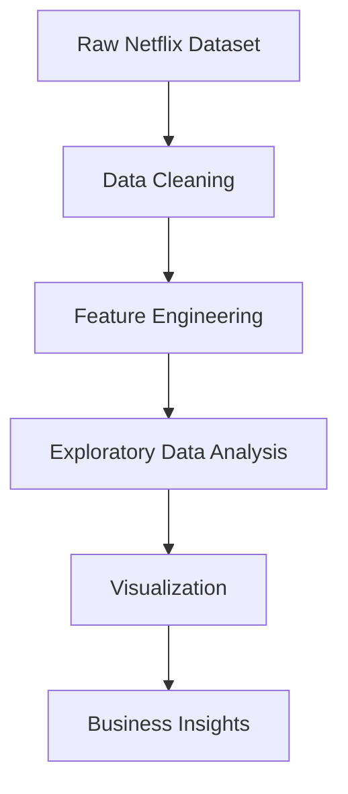

# 🎬 Netflix Data Analysis using Python

## 🚀 Skills Demonstrated

✔ Data Cleaning

✔ Exploratory Data Analysis (EDA)

✔ Feature Engineering

✔ Data Visualization

✔ Business Insights

✔ Pandas

✔ Matplotlib

✔ Python

<div align="center">


---

## 📸 Project Preview


### 📊 Exploratory Data Analysis (EDA) of Netflix Movies & TV Shows Dataset

Analyzing Netflix's content catalogue to discover trends in **movies, TV shows, genres, ratings, countries, release years, and content growth** using **Python, Pandas, and Matplotlib**.

## 📌 Project Statistics

| Metric | Value |
|--------|-------|
| Dataset Size | 8,807 Titles |
| Features | 12 Columns |
| Visualizations | 8 |
| Libraries Used | Pandas, Matplotlib |
| Notebook Cells | 40+ |
| Dataset Source | Kaggle |

</div>

## 📊 Project Visualizations

### Movies vs TV Shows

> **Insight:** Netflix's catalog is dominated by movies, with approximately 70% Movies and 30% TV Shows.

---

### Titles Added Per Year

> **Insight:** Netflix experienced rapid content growth between 2016 and 2019, with 2019 being the peak year for new additions.

---

### Top Genres


---

### Top Countries

> **Insight:** The United States contributes the largest share of titles, followed by India and the United Kingdom.

---

### Content Ratings

> **Insight:** Most Netflix titles are rated TV-MA and TV-14, indicating a strong focus on mature and teen audiences.

---

### Release Year Distribution

> **Insight:** Most content on Netflix consists of titles released after 2010, showing a preference for newer productions.

---

### Genre Popularity by Country

> **Insight:** Genre preferences vary across countries, with the United States and India contributing the highest number of titles across multiple genres.

---

### Years Between Release and Netflix Addition

> **Insight:** Most titles are added to Netflix within a few years of release, reflecting a strategy of acquiring recent content.

---

# 📑 Table of Contents

- Project Overview
- Objectives
- Dataset
- Technologies Used
- Project Workflow
- Key Features
- Visualizations
- Key Insights
- Folder Structure
- How to Run
- Future Improvements
- Author

---

# 🎯 Project Overview

Netflix has one of the world's largest streaming libraries, containing thousands of Movies and TV Shows from different countries and genres.

The goal of this project is to perform **Exploratory Data Analysis (EDA)** on the Netflix dataset to answer important business questions and uncover meaningful insights about Netflix's content strategy.

This project demonstrates the complete Data Analysis workflow including:

- Data Cleaning
- Missing Value Handling
- Feature Engineering
- Data Visualization
- Business Insight Generation

---
## 💡 Business Questions

This project answers questions such as:

• Does Netflix prefer Movies or TV Shows?

• Which countries produce the most content?

• Which genres dominate Netflix?

• Which ratings are most common?

• How quickly are titles added after release?

• Has Netflix's catalogue grown over time?

# 🎯 Objectives

This project aims to answer questions such as:

- 🎬 Does Netflix have more Movies or TV Shows?
- 🌍 Which countries produce the most Netflix content?
- 🎭 Which genres dominate Netflix's catalogue?
- 📈 How has Netflix's library grown over time?
- 🔞 What audience is Netflix mainly targeting?
- 📅 How quickly are titles added after their release?
- 🌎 How does genre popularity vary across countries?

---

# 📂 Dataset

**Dataset Name**

Netflix Movies and TV Shows Dataset

**Source**

Kaggle

**Records**

- **8,807 Titles**

**Features**

- 12 Columns

Main Columns:

- Title
- Type
- Director
- Cast
- Country
- Date Added
- Release Year
- Rating
- Duration
- Genres
- Description

---

# 🛠 Technologies Used

- Python
- Pandas
- Matplotlib
- Jupyter Notebook

---

# 📋 Project Workflow


---

# ✨ Key Features

✅ Cleaned missing values

✅ Converted date columns into datetime format

✅ Created new engineered features

- Year Added
- Month Added
- Years to Add
- Duration Value
- Duration Unit

✅ Exploded multi-value columns

- Genres
- Countries

✅ Generated multiple professional visualizations

✅ Extracted business insights after every visualization

---

# 📌 Key Insights

### 🎬 Content Distribution

- Movies account for **70.4%** of Netflix's catalogue.
- TV Shows account for **29.6%**.
- Netflix places a stronger emphasis on Movies than episodic content.

---

### 📈 Netflix Growth

- The catalogue grew rapidly after **2016**.
- The highest number of titles were added in **2019**.
- This reflects Netflix's global expansion and increased investment in original content.

---

### 🎭 Popular Genres

The most common genres include:

- International Movies
- Dramas
- Comedies

This demonstrates Netflix's focus on globally appealing entertainment.

---

### 🌍 Top Countries

Top content-producing countries:

1. United States
2. India
3. United Kingdom
4. Canada
5. France

The United States dominates the catalogue by a significant margin.

---

### 🔞 Target Audience

The majority of titles are rated:

- TV-MA
- TV-14

This suggests Netflix mainly targets teenagers and adult audiences.

---

### 📅 Content Freshness

Most titles appear on Netflix within a few years after release.

Older classic titles represent only a small portion of the catalogue.

---

### 🌎 Country Preferences

Genre popularity varies across countries.

For example:

- India contributes heavily to International Movies and Dramas.
- The United States has a broader mix of genres.

---

# 📁 Folder Structure

```
Netflix-Data-Analysis/

│
├── data/
│     └── netflix_titles.csv
│
├── images/
│     ├── 01_type_counts.png
│     ├── 02_titles_per_year.png
│     ├── 03_top_genres.png
│     ├── 04_top_countries.png
│     ├── 05_ratings.png
│     ├── 06_release_year_hist.png
│     ├── 07_genre_by_country_heatmap.png
│     └── 08_years_to_add.png
│
├── netflix_data_analysis.ipynb
│
└── README.md
```

---

# 🚀 How to Run

### Clone the repository

```bash
git clone https://github.com/Zuha/Netflix-Data-Analysis.git
```

### Move into the project folder

```bash
cd Netflix-Data-Analysis
```

### Install dependencies

```bash
pip install pandas matplotlib
```

### Launch Jupyter Notebook

```bash
jupyter notebook
```

Open:

```
netflix_data_analysis.ipynb
```

Run all cells.

---

# 📈 Skills Demonstrated

- Data Cleaning
- Data Wrangling
- Feature Engineering
- Exploratory Data Analysis
- Data Visualization
- Business Insight Generation
- Python Programming
- Pandas
- Matplotlib

---

# 🔮 Future Improvements

- Build an interactive Power BI dashboard
- Perform sentiment analysis on title descriptions
- Create a recommendation system using Machine Learning
- Develop an interactive Streamlit web application
- Automate report generation

---
## 📚 What I Learned

During this project I learned:

- Cleaning real-world datasets
- Handling missing values
- Feature engineering
- Working with datetime data
- Creating professional Matplotlib charts
- Extracting business insights from data

# 👩‍💻 Author

**Zoha Maqbool**

Aspiring Data Scientist | Python Developer | AI & Automation Enthusiast

---

⭐ **If you found this project helpful, consider giving it a Star!**

It motivates me to continue building and sharing more Data Science projects.
