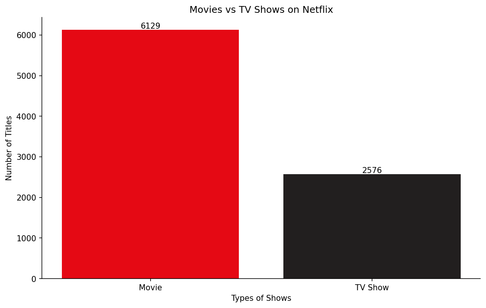
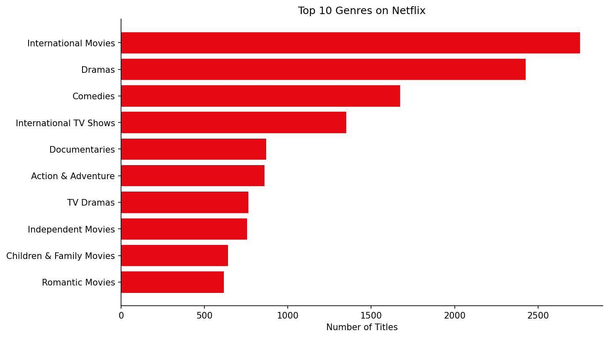
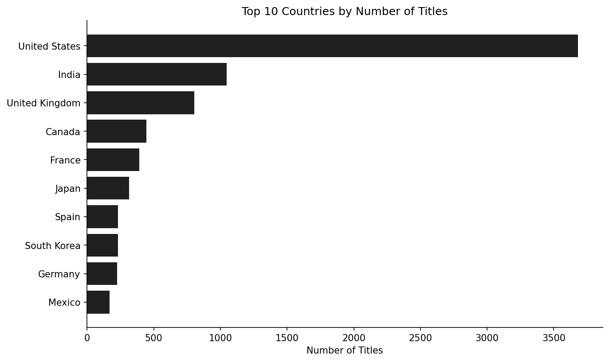
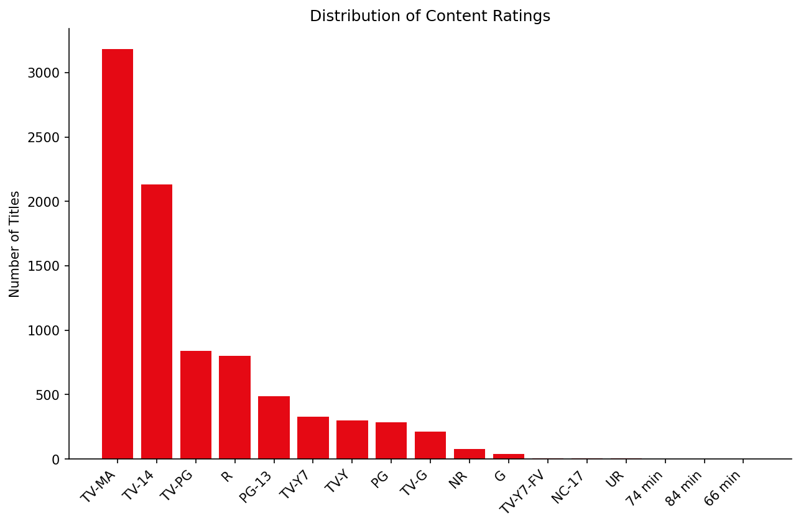
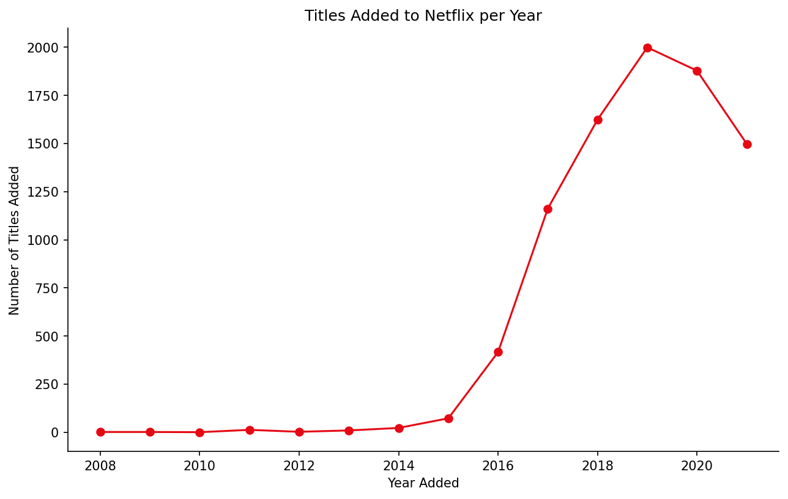
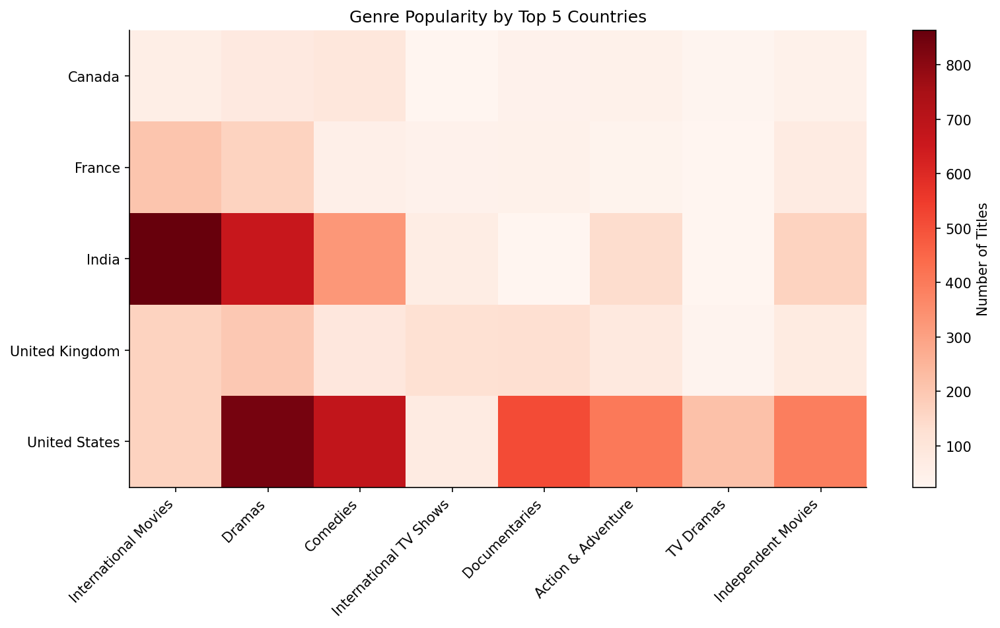
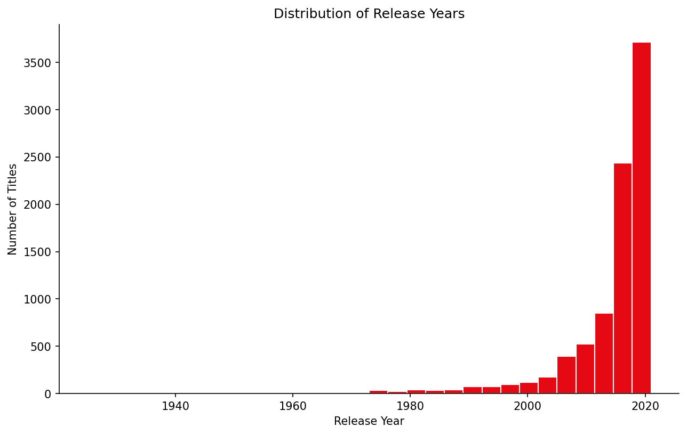
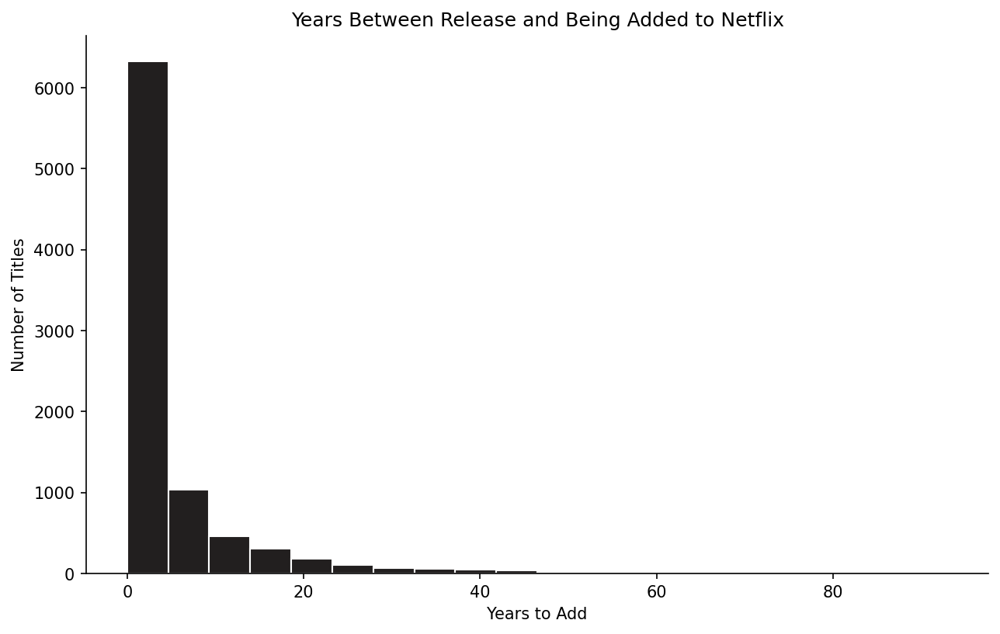

# 🎬 Netflix Data Analysis using Python

<div align="center">

# 📺 Exploratory Data Analysis (EDA) of Netflix Movies & TV Shows Dataset

Analyze Netflix's content catalogue to uncover trends in **Movies, TV Shows, Genres, Countries, Ratings, Release Years, and Content Growth** using **Python, Pandas, and Matplotlib**.


</div>

---


# 📌 Project Statistics

| Metric | Value |
|---------|-------|
| 📂 Dataset Size | **8,807 Netflix Titles** |
| 📊 Visualizations | **8 Professional Charts** |
| 🧹 Missing Values Cleaned | **Yes** |
| ⚙️ Features Engineered | **5+ New Features** |
| 📈 Business Insights Generated | **20+ Insights** |
| 🐍 Language | **Python** |
| 📚 Libraries | **Pandas, Matplotlib** |

---

# 📑 Table of Contents

- Project Overview
- Objectives
- Dataset
- Technologies Used
- Project Workflow
- Key Features
- Visualizations
- Results
- Folder Structure
- How to Run
- Future Improvements
- Author

---

# 🎯 Project Overview

Netflix hosts one of the world's largest streaming libraries, offering thousands of Movies and TV Shows across various countries, genres, and audience categories.

The objective of this project is to perform **Exploratory Data Analysis (EDA)** on the Netflix Movies & TV Shows dataset to uncover patterns, identify trends, and generate meaningful business insights.

This project demonstrates the complete Data Analysis workflow, including:

- Data Cleaning
- Missing Value Handling
- Feature Engineering
- Exploratory Data Analysis (EDA)
- Data Visualization
- Business Insight Generation

---

# 🎯 Objectives

This project answers several key business questions:

- 🎬 Does Netflix have more Movies or TV Shows?
- 🌍 Which countries contribute the most content?
- 🎭 Which genres dominate Netflix's catalogue?
- 📈 How has Netflix's catalogue grown over time?
- 🔞 What audience is Netflix mainly targeting?
- 📅 How quickly are titles added after release?
- 🌎 How do genre preferences differ across countries?

---

# 📂 Dataset

### Dataset Name

Netflix Movies and TV Shows Dataset

### Source

**Kaggle**

https://www.kaggle.com/datasets/shivamb/netflix-shows

### Dataset Information

- **8,807 Titles**
- **12 Features**
- Movies and TV Shows
- Multiple Countries
- Multiple Genres
- Release Years (1925–2021)

### Main Features

- Show ID
- Title
- Type
- Director
- Cast
- Country
- Date Added
- Release Year
- Rating
- Duration
- Listed In (Genres)
- Description

---

# 🛠 Technologies Used

- Python
- Pandas
- Matplotlib
- Jupyter Notebook

---

# 📋 Project Workflow

```text
Netflix Dataset
        │
        ▼
 Data Cleaning
        │
        ▼
 Missing Value Handling
        │
        ▼
 Feature Engineering
        │
        ▼
 Exploratory Data Analysis
        │
        ▼
 Data Visualization
        │
        ▼
 Business Insights
```

---

# ✨ Key Features

✅ Cleaned missing values

✅ Converted date columns into datetime format

✅ Created engineered features

- Year Added
- Month Added
- Years to Add
- Duration Value
- Duration Unit

✅ Exploded multi-value columns

- Genres
- Countries

✅ Created professional visualizations

✅ Generated business insights for every visualization

---

# 📊 Visualizations
📊 Project Visualizations
<table align="center"> <tr> <td align="center" width="50%">
🎬 Movies vs TV Shows


Netflix's catalog is dominated by Movies, accounting for around 70% of all titles.

</td> <td align="center" width="50%">
🎭 Top Genres


International Movies, Dramas, and Comedies are the most popular genres on Netflix.

</td> </tr> <tr> <td align="center">
🌍 Top Countries


The United States contributes the most titles, followed by India and the United Kingdom.

</td> <td align="center">
🔞 Content Ratings


Most titles are rated TV-MA and TV-14, indicating a focus on mature and teen audiences.

</td> </tr> <tr> <td align="center">
📈 Titles Added Per Year


Netflix experienced its fastest catalog growth between 2016 and 2019, peaking in 2019.

</td> <td align="center">
🌎 Genre Popularity by Country


The United States offers the widest genre variety, while India strongly emphasizes International Movies and Dramas.

</td> </tr> <tr> <td align="center">
📅 Release Year Distribution


Most Netflix content consists of titles released after 2010, highlighting a preference for newer productions.

</td> <td align="center">
⏳ Years to Add on Netflix


Most titles are added to Netflix within just a few years of their original release.

</td> </tr> </table>

---

## 🎬 Movies vs TV Shows


> **Insight:** Movies dominate Netflix's catalogue, accounting for approximately **70%** of all titles, while TV Shows make up around **30%**.

---

## 📈 Titles Added to Netflix per Year


> **Insight:** Netflix experienced rapid growth between **2016 and 2019**, reaching its highest number of new additions in **2019** before a slight decline.

---

## 🎭 Top Genres


> **Insight:** International Movies, Dramas, and Comedies are the most common genres, reflecting Netflix's focus on globally appealing entertainment.

---

## 🌍 Top Content-Producing Countries


> **Insight:** The United States contributes the largest share of titles, followed by India and the United Kingdom.

---

## 🔞 Distribution of Content Ratings


> **Insight:** Most Netflix titles are rated **TV-MA** and **TV-14**, indicating that the platform primarily targets mature and teenage audiences.

---

## 📅 Distribution of Release Years


> **Insight:** The majority of Netflix's catalogue consists of titles released after **2010**, showing a strong emphasis on recent productions.

---

## 🌎 Genre Popularity by Country


> **Insight:** Genre popularity varies across countries. The United States offers a diverse mix of genres, while India contributes heavily to International Movies and Dramas.

---

## ⏳ Years Between Release and Netflix Addition


> **Insight:** Most titles are added to Netflix within only a few years after release, demonstrating Netflix's strategy of acquiring recent content.

---

# 📈 Results

The analysis revealed several interesting trends about Netflix's content strategy:

- 🎬 Movies account for over **70%** of the platform's catalogue.
- 📈 Netflix expanded rapidly between **2016–2019**, with **2019** recording the highest number of new additions.
- 🎭 International Movies, Dramas, and Comedies are the most represented genres.
- 🌍 The United States is the largest contributor of content, followed by India and the United Kingdom.
- 🔞 Most titles target mature and teenage audiences through TV-MA and TV-14 ratings.
- 📅 Netflix increasingly acquires content shortly after its original release.
- 🌎 Genre preferences differ noticeably between countries, highlighting Netflix's regional content strategy.

---

# 📁 Folder Structure

```text
Netflix-Data-Analysis/

│
├── data/
│   └── netflix_titles.csv
│
├── images/
│   ├── project_preview.png
│   ├── 01_type_counts.png
│   ├── 02_titles_per_year.png
│   ├── 03_top_genres.png
│   ├── 04_top_countries.png
│   ├── 05_content_ratings.png
│   ├── 06_release_year_hist.png
│   ├── 07_genre_by_country_heatmap.png
│   └── 08_years_to_add_hist.png
│
├── netflix_data_analysis.ipynb
├── README.md
├── requirements.txt
└── .gitignore
```

---

# 🚀 How to Run

### Clone the Repository

```bash
git clone https://github.com/zuhamaqbul-cyber/Netflix-Data-Analysis.git
```

### Navigate to the Project Folder

```bash
cd Netflix-Data-Analysis
```

### Install Dependencies

```bash
pip install -r requirements.txt
```

### Launch Jupyter Notebook

```bash
jupyter notebook
```

Open:

```text
netflix_data_analysis.ipynb
```

Run all cells to reproduce the complete analysis.

---

# 📒 Notebook

The complete analysis is available here:

**➡️ [netflix_data_analysis.ipynb](netflix_data_analysis.ipynb)**

---

# 💡 Skills Demonstrated

- Data Cleaning
- Data Wrangling
- Exploratory Data Analysis (EDA)
- Feature Engineering
- Data Visualization
- Business Insight Generation
- Python Programming
- Pandas
- Matplotlib
- Git & GitHub

---

# 🔮 Future Improvements

- 📊 Create an interactive Power BI Dashboard
- 🌐 Develop a Streamlit Web Application
- 🤖 Build a Movie Recommendation System
- 📈 Add interactive Plotly visualizations
- 🗄️ Perform SQL-based analysis
- 🧠 Apply Machine Learning techniques for content recommendation

---

# 👩‍💻 Author

## Zoha Maqbool

**Aspiring Data Scientist | Python Developer | AI & Automation Enthusiast**

---

⭐ **If you found this project helpful, consider giving it a Star!**

It motivates me to continue building and sharing more Data Science projects.
